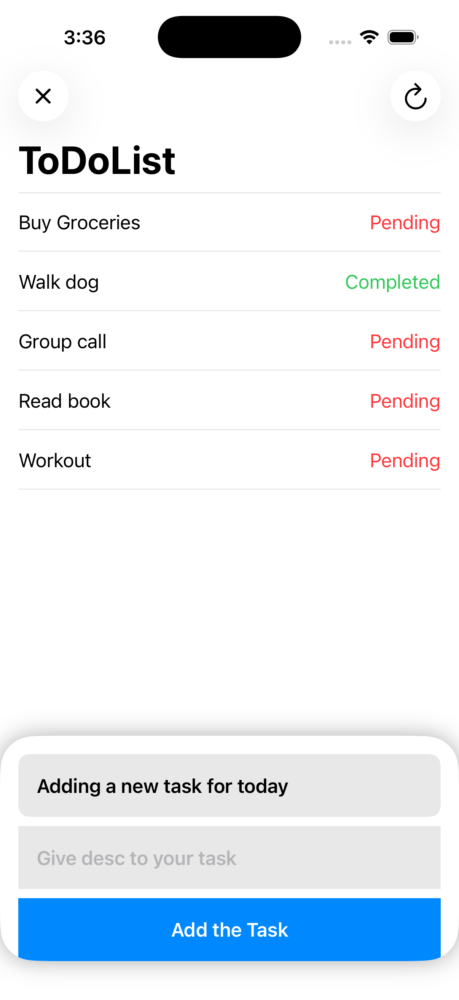
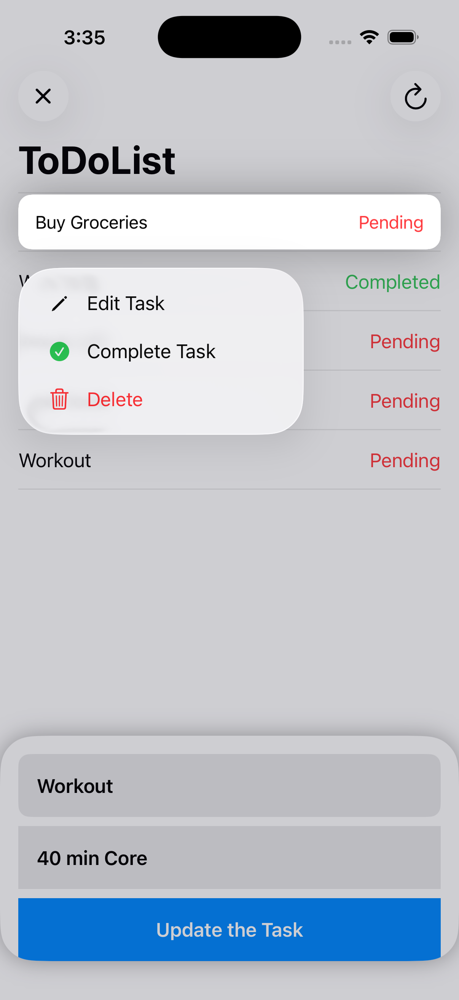
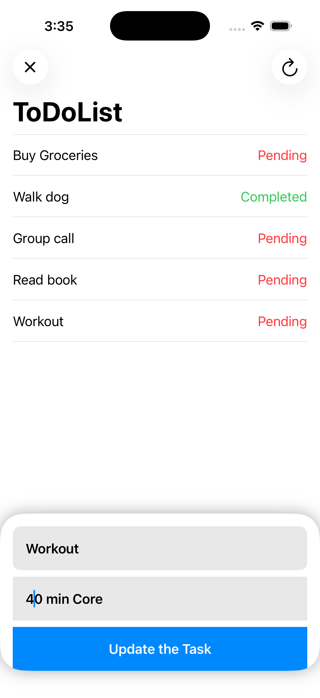

# SampleToDoApp

[](https://swift.org)
[](https://developer.apple.com/ios/)
[](LICENSE)

A simple **To-Do List app** built using **SwiftUI** and **Core Data**. This app demonstrates task management with features like adding, editing, deleting, marking tasks as completed, and expandable task descriptions.

---

## Features

- **Add Task**: Add a new task with a title and description using an animated panel.  
- **Edit Task**: Update task title and description via a context menu.  
- **Delete Task**: Swipe to delete or use the context menu.  
- **Mark as Complete / Pending**: Toggle task status, with color-coded indicators (green for completed, orange for pending).  
- **Animated Add Panel**: Smooth slide-in panel for adding new tasks.  
- **Refresh Tasks**: Fetch tasks using a toolbar button.  
- **Context Menu**: Options to Edit, Complete/Mark Pending, and Delete.  

---
## Screenshots

<table>
  <tr>
    <td align="center">
      <br>
      Add Task Panel
    </td>
    <td align="center">
      <br>
      Context Menu
    </td>
    <td align="center">
      <br>
      Delete a task
    </td>
    <td align="center">
      <br>
      Edit a task
    </td>
  </tr>
</table>


---

## Installation

1. Clone the repository:

```bash
git clone https://github.com/rpc1418/SampleToDoApp-CoreData.git
```

2. Open the project in **Xcode 15+**.  
3. Build and run on a simulator or device (**iOS 17+ recommended**).
   
## Usage

1. Tap the **+ button** to add a new task.  
2. Fill in the title and description, then tap **Add the Task**.  
3. Use the **context menu** on a task to Edit, Complete/Mark Pending, or Delete.  
4. Swipe left on a task to delete directly.  
5. Use the **refresh button** to reload tasks.  

---

## Technologies Used

- **SwiftUI** – Declarative UI framework for iOS.  
- **Core Data** – Persistent local storage for tasks.  
- **Xcode 15+** – Development environment. 
